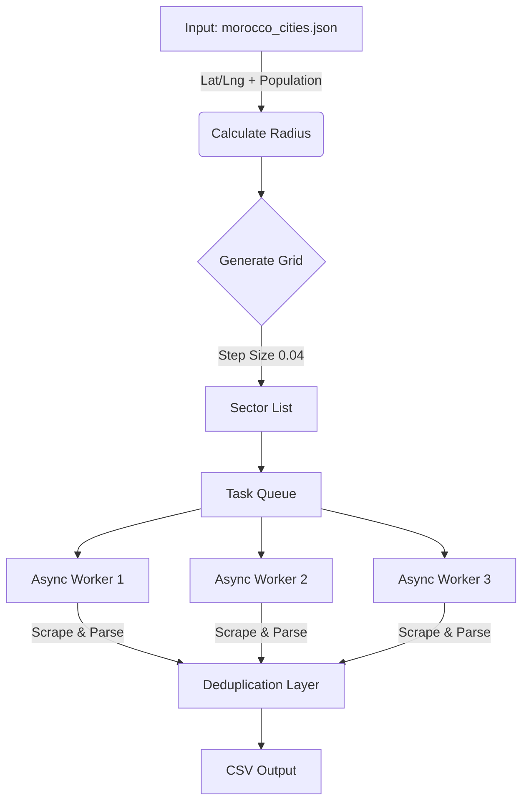

# 🗺️ Morocco Maps Scraper

**High-Performance Geospatial Data Extraction Engine**

A production-ready, Dockerized Python application designed to scrape business data (Cafes, Restaurants, etc.) from Google Maps across entire cities. It utilizes **Asyncio**, **Playwright**, and a **Geospatial Grid Algorithm** to bypass search limits and ensure maximum coverage.

---

## 🏗️ Architecture & Algorithm

This tool does not simply search "Cafe in Casablanca" (which is limited to 120 results). Instead, it mathematically divides a city into hundreds of small sectors and scrapes them in parallel.

### How the Algorithm Works

1.  **Input Analysis:** It reads `morocco_cities.json` to get the City Center (`lat`, `lng`) and `Population`.
2.  **Dynamic Radius:** It calculates a scanning radius based on population (e.g., 15km for Casablanca, 4km for small towns).
3.  **Grid Generation:** It overlays a mathematical grid over the city.
4.  **Parallel Execution:** Async workers process multiple grid sectors simultaneously.


---
## 🚀 Quick Start (Docker)

The recommended way to run the scraper is via Docker. This ensures all browser dependencies and drivers are pre-installed.

1. Build the Container
```bash
docker-compose build
```
2. Run the Scraper
```bash
docker-compose up
```

The scraper will start immediately. Data is saved to data.csv in real-time.

3. Stop the Scraper

Press ```Ctrl + C``` to stop gracefully.

---

## ⚙️ Configuration & Tuning

The scraper is highly configurable. You can adjust parameters in scraper.py to balance between Speed, Coverage, and Stability.

### 1. Search Keywords

Define what businesses to look for. The script searches these keywords sequentially for every grid sector.

```py
# scraper.py
KEYWORDS = ["Cafe", "Restaurant", "Snack", "Tea House", "Pizzeria", "Fast Food"]
```

### 2. Grid Precision (`STEP_SIZE`)
This is the most important setting. It controls how "tight" the grid is.

| Value | Mode | Description |
| :--- | :--- | :--- |
| **0.04** | **Test Mode** | Large grid boxes (~4km). Fast scan. Good for checking if cities are working. Misses small businesses. |
| **0.02** | **Standard** | Medium grid (~2km). Balanced speed and accuracy. |
| **0.015** | **Production** | Tight grid (~1.5km). **Maximum accuracy**. Captures hidden/small cafes. Takes significantly longer. |

```python
# scraper.py
STEP_SIZE = 0.015  # Recommended for final production runn/small cafes. Takes significantly longer.
```

### 3. Concurrency (`CONCURRENT_TABS`)
Controls how many browser tabs open simultaneously.

| Value | Description |
| :--- | :--- |
| **4** | Safe. Low RAM usage. Very low risk of IP bans. |
| **6-8** | **Optimized.** Good for i5/i7 processors. Fast processing. |
| **12+** | Risky. May trigger Google CAPTCHAs or crash standard RAM (8GB). |

```python
# scraper.py
CONCURRENT_TABS = 6
```
